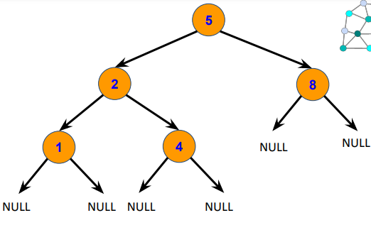

# Estrutura de dados

Nesse repositório irei explicar como funciona e como criar algumas estruturas de dados.

## dynamic_allocation(Alocação dinamica)

esse código mostra apenas um exemplo de como alocar memoria em tempo de execução e liberar memoria.

## Queue(Fila)

Na fila a regra é bem simples cada elemento deve ser adicionado sempre no final e removido no começo como uma fila real.

## Stack(pilha)

A pilha também tem uma regra bem simples, todo elemento é adicionado no final e removido pelo final.

## List(list)

A lista é um caso mais genérico onde cada elemento pode ser adicionado em qualquer lugar da lista e removido também em qualquer lugar a implementação dela também é simples de fazer.

## Tree(árvore binária)

A árvore é uma estrutura não linear que funciona de uma forma bem diferente a cada item na árvore pode ter no máximo 2 referencias para outros 2 itens criando essa estrutura de árvore.

## Binary Search(busca binaria)

A busca binaria pode ser usado apenas em estruturas lineares e ordenadas, mas é extremamente rápida
podendo achar qualquer elemento de 1 a mil em no maximo 10 comparações, é de assustar o quão rápido ela é usando apenas matematica, ela é uma busca que vai dividindo o array em dois e andando na direção do objeto já que o array é ordenado e se torna extremamente rápida.

## Tabela hash

É uma maneira de armazenar e buscar os dados rápido usando uma função que gera um indice para o objeto guardado de acorco com uma key.

